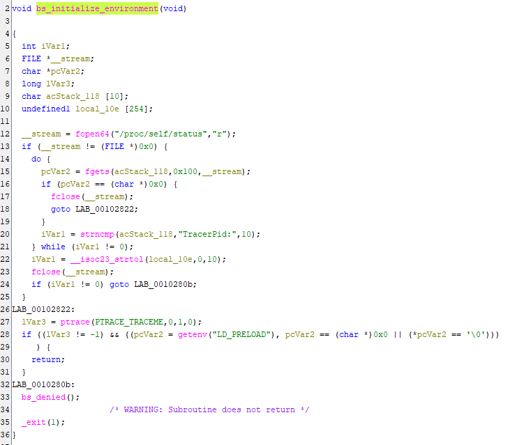
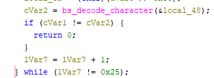
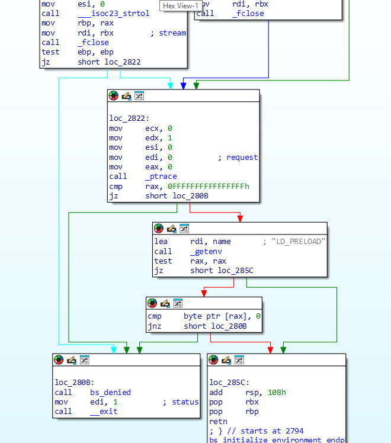
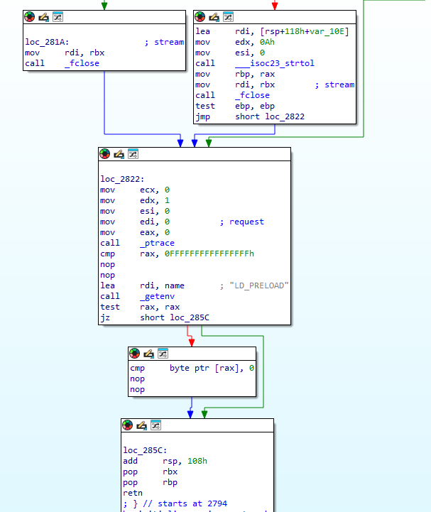
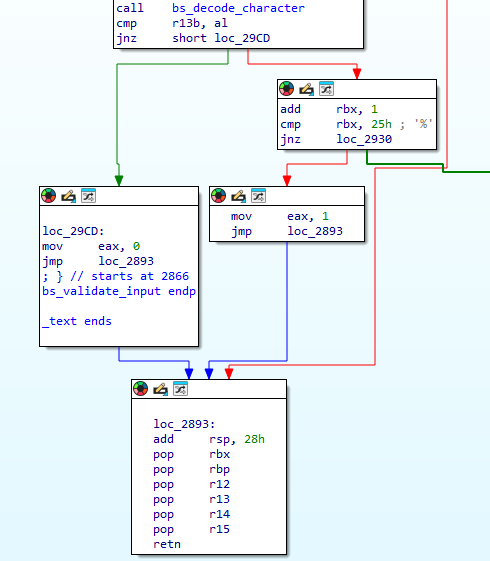
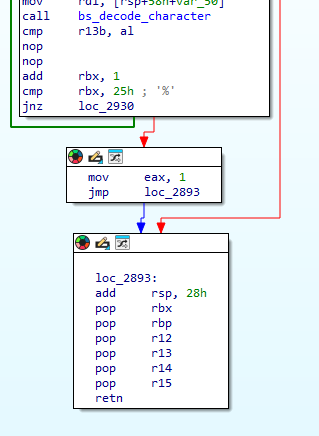
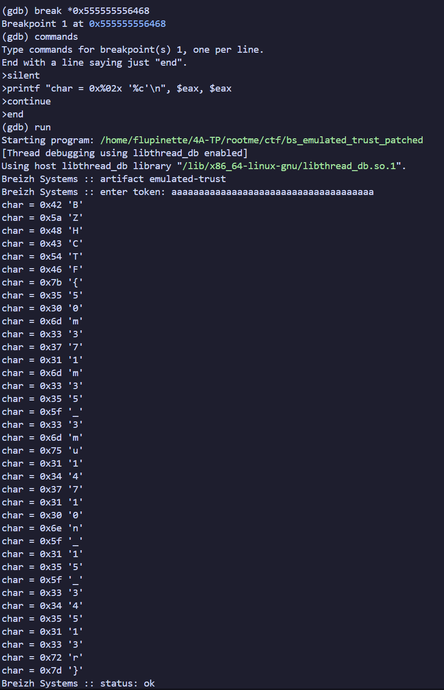

# Emulated Trust

Un autre challenge de la catégorie reverse fournissait un exécutable linux nommé ``bs_emulated_trust``.

## Résolution du challenge

On ouvre le fichier dans Ghidra. Le main appelle plusieurs fonctions. L'une d'entre elles, ``bs_initialize_environment``, vérifie que la fonction n'est pas débuggée grâce à 3 checks différents : [ptrace](http://manpagesfr.free.fr/man/man2/ptrace.2.html), /proc/self/status et getenv("LD_PRELOAD"). Dans le cas contraire, elle arrête le programme.

Le main appelle aussi ``bs_validate_input`` qui vérifie si la chaîne entrée est correcte et fait 37 caractères. Pour chaque caractère, elle appelle ``bs_decode_character`` et compare le caractère retournée par la fonction avec celui écrit par l'utilisateur. ``bs_decode_character`` sert à décoder le caractère attendu.

Pour éviter de lire le code assembleur très obfusqué, les checks anti-debug sont patchés afin de pouvoir débugger.

Les trois flèches allant sur le bloc appelant la fonction de refus ``bs_denied`` représente trois check d'anti debug.

En passant d'un saut conditionnel à un saut inconditionnel ou en nopant les sauts pour que la fonction ne saute jamais à l'appel de ``bs_denied``, la fonction peut enfin être debuggée sans prise de tête.

Pour pouvoir observer chaque caractère retourné par la fonction ``bs_decode_character`` lors du débuggage, la vérification individuelle de chaque caractère est également patchée afin de tout voir en un seul passage.

Avant.

Après.

Une fois cela fait, on lance le débuggeur avec un point d'arrêt après chaque retour de la fonction ``bs_decode_character`` pour chaque i. À chaque arrêt sur un breakpoint, le contenu du registre eax est imprimé puis l'exécution continue.

Le flag est ``BZHCTF{50m371m35_3mu14710n_15_34513r}`` !