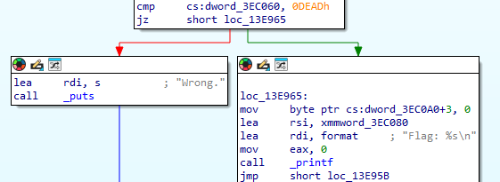
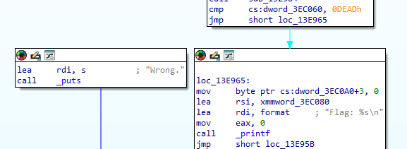
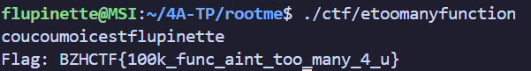

# ETOOMANYFUNCTIONS

Un autre challenge de la catégorie reverse fournissait un exécutable linux nommé ``etoomanyfinction``.

## Résolution du challenge

On ouvre le fichier dans Ghidra. On se rend compte qu'il y a au moins des centaines de fonction. Cool.

En regardant la première fonction appelée après l'entrée du programme, on remarque qu'elle affiche le flag d'elle-même après un if.

Pourquoi s'embêter à tout lire alors qu'on pourrait simplement patcher ce if afin de toujours tomber sur l'affichage du flag ? Le saut conditionnel vers le flag est remplacé par un saut inconditionnel.

Avant.

Après.

En appelant simplement le programme après le patch, le flag apparaît : ``BZHCTF{100k_func_aint_too_many_4_u}``.

