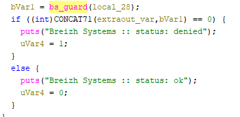
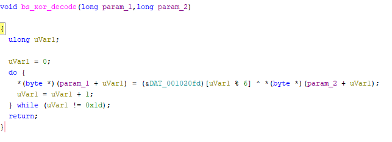
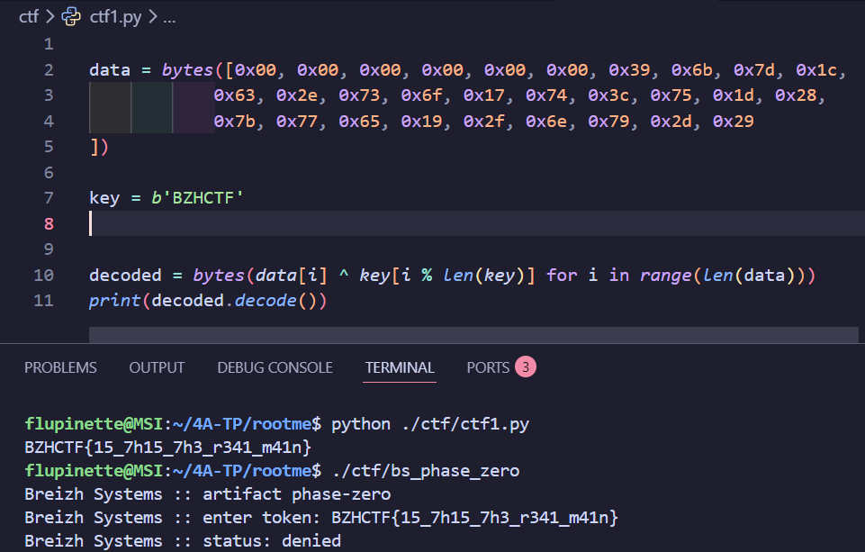
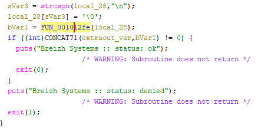
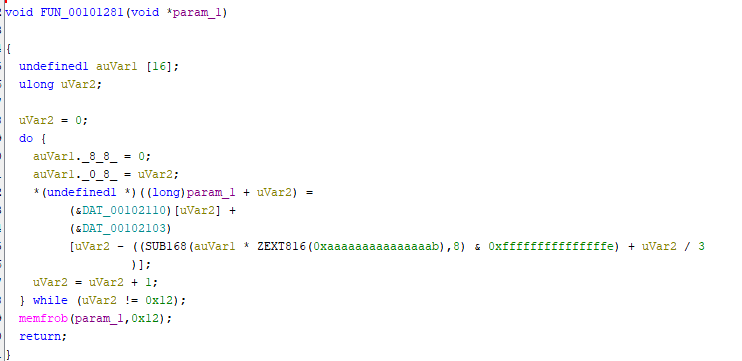
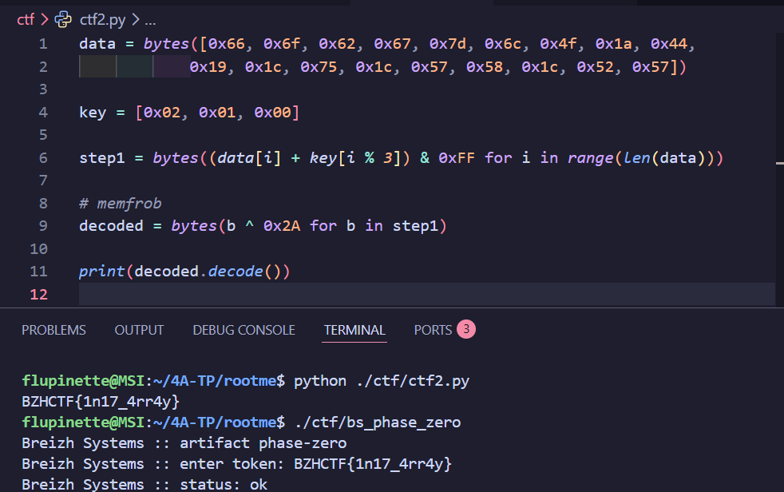

# Phase Zero

Un autre challenge de la catégorie reverse fournissait un exécutable linux nommé ``bs_phase_zero``.

## Résolution du challenge

On ouvre le fichier dans Ghidra. Le main lit ce qui est écrit dans le terminal, appelle une fonction ``bs_guard`` et affiche un message de refus ou non selon la valeur retournée.

En analysant la fonction ``bs_guard``, on s'aperçoit qu'elle appelle aussi une autre fonction appellée ``bs_xor_decode`` pour comparer l'une des valeurs modifiées par la fonction à l'input. Celle-ci est beaucoup plus intéressante.

``bs_xor_decode`` XORe le message situé à 0x1020e0 avec la clé située à 0x1020fd mod 6. Clé = 42 5A 48 43 54 46 = "BZHCTF"

Un petit programme python permet de retrouver la valeur originale et donne le flag ``BZHCTF{15_7h15_7h3_r341_m41n}``. Malheureusement, ce n'est pas le bon... Il faut chercher ailleurs.

On retourne lire les fonctions. Visiblement quelque chose a été manqué, ce qui amène à aller regarder du côté des fonctions d'initialisation.
Elle a à peu près la même tête que le main mais appelle des fonctions différentes.

En avançant un peu, on tombe sur la fonction ``FUN_00101281`` qui construit le flag ainsi :

Les données de base sont à l'adresse 0x102110 : 66 6f 62 67 7d 6c 4f 1a 44 19 1c 75 1c 57 58 1c 52 57. La clé est à l'adresse 0x102103 : [02, 01, 00] qui se répète grâce au modulo. La fonction construit le flag en faisant flag[i] = data[i] + key[i%3] puis [memfrob](https://linux.die.net/man/3/memfrob) XORe chaque octets avec 42.

Un programme python est codé pour retrouvé le flag original et celui-là passe ! Le flag était ``BZHCTF{1n17_4rr4y}``.

