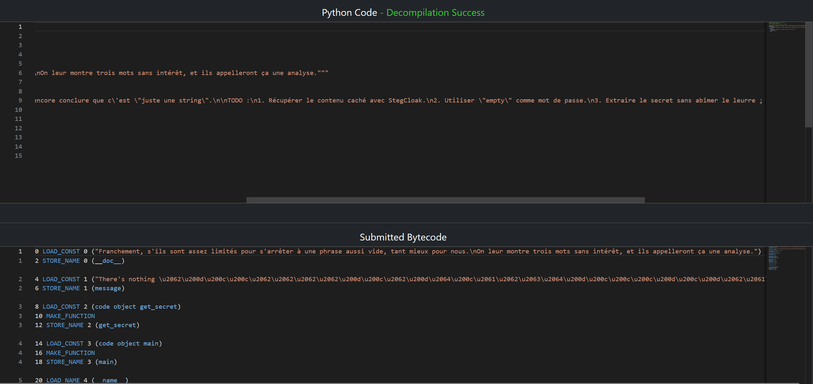
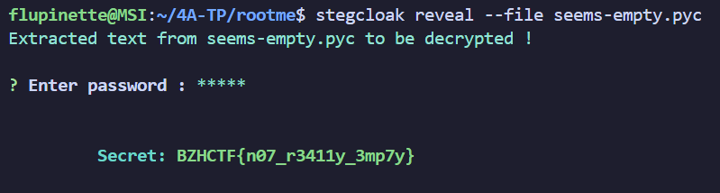

# Seems empty

Le premier challenge de la catégorie reverse fournissait uniquement un fichier ``.pyc``. ``.pyc`` est un fichier python compilé.

## Résolution du challenge

En utilisant le site [pylingual](https://pylingual.io/view_chimera?identifier=6cb0bd3494d5347aad17aa955cfc72578a807e911b5d13eec62e16377fa4db07) pour décompiler le fichier, on a accès au code source:

Le code invite à utiliser StegCloak avec le mot de passe ``empty`` pour récupérer le contenu caché.

En lisant le [GitHub de StegCloak](https://github.com/kurolabs/stegcloak), on voit qu'on peut utiliser ``stegcloak reveal --file <file>`` de manière à extraire le message du fichier

Après installation de StegCloak et lancement sur ``seems-empty.pyc`` avec le mot de passe ``empty``, on récupère le flag ``BZHCTF{n07_r3411y_3mp7y}``.

